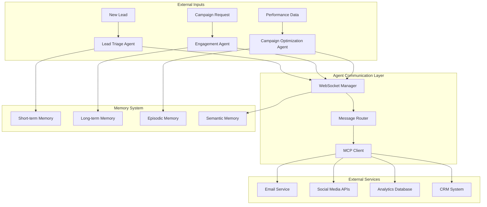
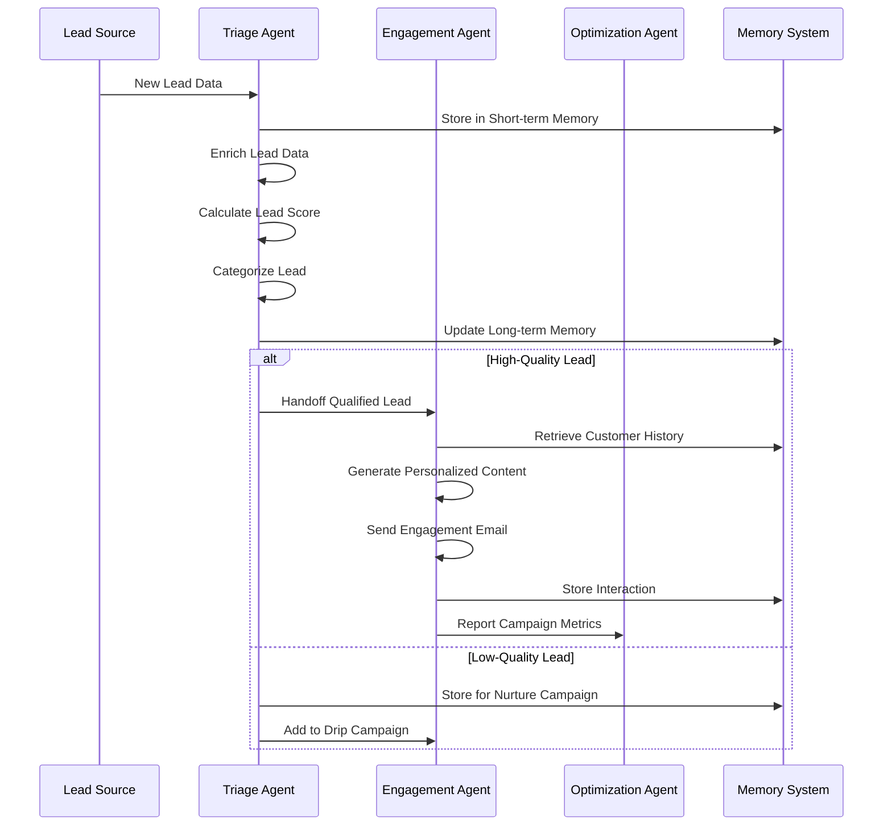
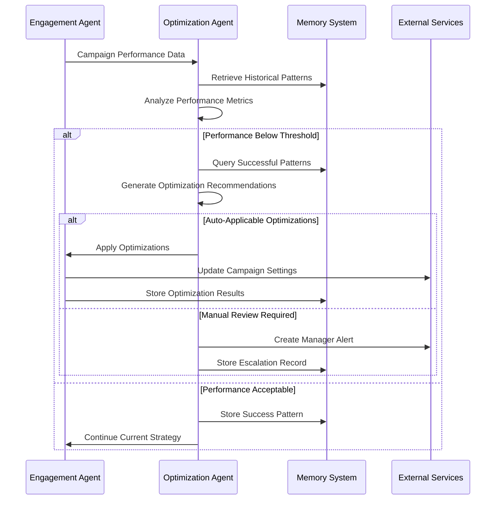
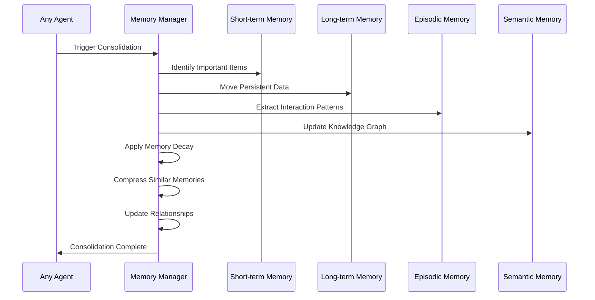
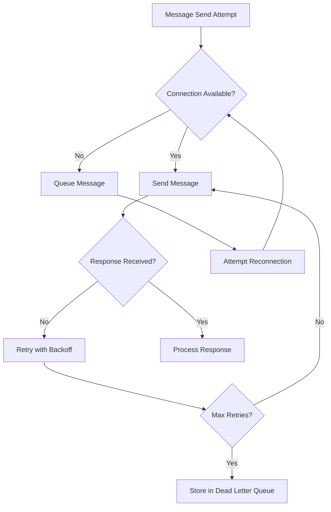
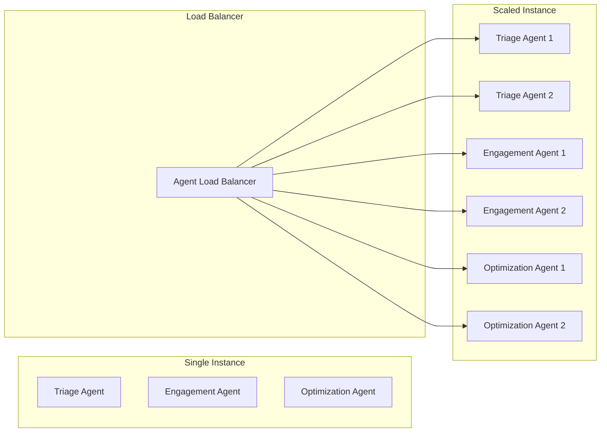

# Agent Interaction Analysis with Conversation Flow Diagrams

## Overview

This document provides detailed analysis of agent interactions within the AIML Marketing Multi-Agent System, including conversation flow diagrams, handoff protocols, and communication patterns.

## Agent Communication Architecture



## Conversation Flow Patterns

### 1. Lead Processing Flow



### 2. Campaign Optimization Flow



### 3. Memory Consolidation Flow



## Agent Handoff Protocols

### 1. Context Preservation

When agents hand off conversations or tasks, the following context is preserved:

```typescript
interface HandoffContext {
  conversationId: string;
  leadId: string;
  currentIntent: string;
  conversationHistory: Message[];
  customerPreferences: CustomerPreferences;
  previousActions: AgentAction[];
  urgencyLevel: number;
  specialInstructions: string[];
}
```

### 2. Handoff Decision Matrix

| From Agent | To Agent | Trigger Condition | Context Transferred |
|------------|----------|-------------------|-------------------|
| Triage | Engagement | Lead Score > 60 | Lead profile, categorization, recommended approach |
| Engagement | Optimization | Campaign metrics available | Campaign data, performance metrics, customer feedback |
| Optimization | Engagement | Optimization recommendations | Performance analysis, recommended changes |
| Any Agent | Manager | Escalation criteria met | Full context, issue description, recommended actions |

### 3. Handoff Validation

```typescript
class HandoffValidator {
  static validateHandoff(context: HandoffContext): boolean {
    return (
      context.conversationId !== null &&
      context.leadId !== null &&
      context.conversationHistory.length > 0 &&
      context.urgencyLevel >= 1 &&
      context.urgencyLevel <= 10
    );
  }
}
```

## Communication Patterns

### 1. Synchronous Communication

Used for immediate responses and critical operations:

```typescript
// Direct agent-to-agent communication
const result = await sourceAgent.requestImmediate(targetAgent, {
  type: 'urgent_lead_qualification',
  leadId: 'lead_123',
  timeout: 5000
});
```

### 2. Asynchronous Communication

Used for non-critical updates and background processing:

```typescript
// Event-driven communication
await sourceAgent.emit('lead_updated', {
  leadId: 'lead_123',
  updates: { score: 85, category: 'hot_prospect' }
});
```

### 3. Broadcast Communication

Used for system-wide notifications:

```typescript
// System-wide broadcast
await orchestrator.broadcast('system_maintenance', {
  scheduledTime: '2025-01-15T02:00:00Z',
  estimatedDuration: '30 minutes'
});
```

## Error Handling and Recovery

### 1. Communication Failures



### 2. Agent Recovery Procedures

```typescript
class AgentRecoveryManager {
  async recoverAgent(agentId: string): Promise<void> {
    // 1. Preserve current state
    const currentState = await this.captureAgentState(agentId);
    
    // 2. Restart agent
    await this.restartAgent(agentId);
    
    // 3. Restore critical memory
    await this.restoreAgentMemory(agentId, currentState);
    
    // 4. Resume processing
    await this.resumeAgentProcessing(agentId);
  }
}
```

## Performance Optimization Patterns

### 1. Memory Access Optimization

```typescript
class OptimizedMemoryAccess {
  private cache = new Map<string, any>();
  
  async retrieve(query: any): Promise<any[]> {
    const cacheKey = this.generateCacheKey(query);
    
    if (this.cache.has(cacheKey)) {
      return this.cache.get(cacheKey);
    }
    
    const results = await this.performQuery(query);
    this.cache.set(cacheKey, results);
    
    return results;
  }
}
```

### 2. Batch Processing Pattern

```typescript
class BatchProcessor {
  private batchQueue: any[] = [];
  private batchSize = 50;
  private batchTimeout = 5000;
  
  async addToBatch(item: any): Promise<void> {
    this.batchQueue.push(item);
    
    if (this.batchQueue.length >= this.batchSize) {
      await this.processBatch();
    }
  }
  
  private async processBatch(): Promise<void> {
    const batch = this.batchQueue.splice(0, this.batchSize);
    await this.processItems(batch);
  }
}
```

## Monitoring and Observability

### 1. Conversation Tracking

```typescript
interface ConversationMetrics {
  conversationId: string;
  startTime: Date;
  endTime?: Date;
  agentsInvolved: string[];
  handoffCount: number;
  resolutionTime: number;
  customerSatisfaction: number;
  outcome: 'resolved' | 'escalated' | 'abandoned';
}
```

### 2. Agent Performance Metrics

```typescript
interface AgentPerformanceMetrics {
  agentId: string;
  processingTime: number;
  successRate: number;
  errorRate: number;
  memoryEfficiency: number;
  learningRate: number;
  collaborationScore: number;
}
```

### 3. System Health Indicators

```typescript
interface SystemHealthMetrics {
  overallHealth: 'healthy' | 'degraded' | 'critical';
  agentStatuses: Record<string, AgentStatus>;
  communicationLatency: number;
  memoryUtilization: number;
  throughput: number;
  errorRate: number;
}
```

## Scalability Considerations

### 1. Agent Scaling Patterns



### 2. Memory Scaling Strategy

```typescript
interface DistributedMemoryStrategy {
  shortTerm: 'local'; // Keep on agent instance
  longTerm: 'distributed'; // Shared across instances
  episodic: 'partitioned'; // Partitioned by agent type
  semantic: 'replicated'; // Replicated across all instances
}
```

## Testing Conversation Flows

### 1. Unit Tests for Agent Communication

```typescript
describe('Agent Communication', () => {
  it('should successfully hand off qualified lead', async () => {
    const triageAgent = new LeadTriageAgent(mockMCP, mockWS);
    const engagementAgent = new EngagementAgent(mockMCP, mockWS);
    
    const lead = createMockLead({ score: 85 });
    const result = await triageAgent.processAction({
      type: 'CATEGORIZE_LEAD',
      payload: { lead }
    });
    
    expect(result.success).toBe(true);
    expect(mockWS.sendMessage).toHaveBeenCalledWith(
      expect.objectContaining({
        type: 'AGENT_HANDOFF',
        payload: expect.objectContaining({
          targetAgent: 'engagement_agent'
        })
      })
    );
  });
});
```

### 2. Integration Tests for Full Flows

```typescript
describe('End-to-End Lead Processing', () => {
  it('should process lead from intake to engagement', async () => {
    const orchestrator = new AgentOrchestrator();
    await orchestrator.initialize();
    
    const leadData = {
      name: 'Test Lead',
      email: 'test@example.com',
      source: 'website_form'
    };
    
    const result = await orchestrator.processNewLead(leadData);
    
    expect(result.success).toBe(true);
    expect(result.data.category).toBeDefined();
    expect(result.data.score).toBeGreaterThan(0);
  });
});
```

This comprehensive conversation flow analysis ensures robust agent communication, proper context preservation, and reliable system operation under various scenarios.