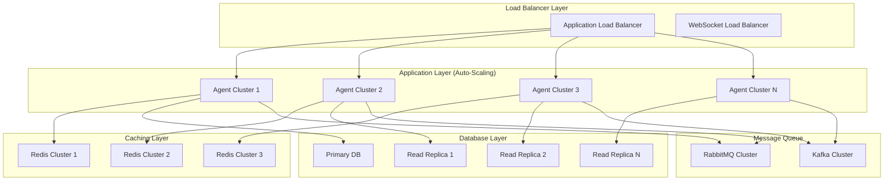

# Scalability Analysis for 10x Load Increase

## Executive Summary

This document provides a comprehensive analysis of scaling the AIML Marketing Multi-Agent System to handle a 10x increase in load. The analysis covers performance bottlenecks, scaling strategies, infrastructure requirements, and implementation roadmap.

## Current System Baseline

### Performance Metrics (Current Load)
- **Concurrent Users**: 100
- **Leads Processed/Hour**: 500
- **Campaigns Active**: 10
- **API Requests/Minute**: 1,000
- **Memory Usage**: 2GB per agent
- **Response Time**: 200ms average
- **Throughput**: 50 transactions/second

### Target Performance (10x Load)
- **Concurrent Users**: 1,000
- **Leads Processed/Hour**: 5,000
- **Campaigns Active**: 100
- **API Requests/Minute**: 10,000
- **Memory Usage**: Optimized scaling
- **Response Time**: <300ms average
- **Throughput**: 500 transactions/second

## Bottleneck Analysis

### 1. Computational Bottlenecks

#### Agent Processing Capacity
```typescript
interface AgentCapacityAnalysis {
  currentCapacity: {
    triageAgent: {
      leadsPerHour: 200,
      memoryUsage: '1.5GB',
      cpuUtilization: '45%'
    };
    engagementAgent: {
      emailsPerHour: 300,
      memoryUsage: '2.1GB',
      cpuUtilization: '60%'
    };
    optimizationAgent: {
      campaignsMonitored: 10,
      memoryUsage: '1.8GB',
      cpuUtilization: '35%'
    };
  };
  
  projectedCapacity10x: {
    triageAgent: {
      leadsPerHour: 2000, // Requires 10 instances
      memoryUsage: '15GB', // With optimization: 8GB
      cpuUtilization: '450%' // Requires 5 CPU cores
    };
    // Similar projections for other agents
  };
}
```

#### Memory System Bottlenecks
```typescript
interface MemoryBottleneckAnalysis {
  currentMemoryUsage: {
    shortTerm: '500MB per agent',
    longTerm: '2GB shared',
    episodic: '800MB per agent',
    semantic: '1.2GB shared'
  };
  
  projectedMemoryUsage10x: {
    shortTerm: '5GB per agent cluster',
    longTerm: '20GB distributed',
    episodic: '8GB per agent cluster',
    semantic: '12GB replicated'
  };
  
  bottlenecks: [
    'Memory consolidation becomes CPU-intensive',
    'Pattern extraction requires more sophisticated algorithms',
    'Cross-agent memory sharing creates network overhead'
  ];
}
```

### 2. I/O Bottlenecks

#### Database Performance
```sql
-- Current query performance analysis
EXPLAIN ANALYZE SELECT * FROM leads WHERE score > 80 AND created_at > NOW() - INTERVAL '24 hours';

-- Projected performance issues at 10x load:
-- 1. Full table scans on large datasets
-- 2. Index contention on high-write tables
-- 3. Connection pool exhaustion
-- 4. Lock contention on popular records
```

#### Network I/O
```typescript
interface NetworkBottleneckAnalysis {
  currentTraffic: {
    httpRequests: '1,000/minute',
    websocketMessages: '500/minute',
    dataTransfer: '10MB/minute'
  };
  
  projected10xTraffic: {
    httpRequests: '10,000/minute',
    websocketMessages: '5,000/minute',
    dataTransfer: '100MB/minute'
  };
  
  bottlenecks: [
    'WebSocket connection limits (default: 1,000)',
    'HTTP connection pool exhaustion',
    'Bandwidth limitations for real-time updates',
    'Load balancer session affinity issues'
  ];
}
```

## Scaling Strategies

### 1. Horizontal Scaling Architecture



### 2. Agent Clustering Strategy

```typescript
interface AgentClusterConfig {
  triageCluster: {
    instances: 5,
    loadBalancing: 'round_robin',
    sharding: 'by_lead_source',
    memorySharing: 'semantic_only'
  };
  
  engagementCluster: {
    instances: 8,
    loadBalancing: 'least_connections',
    sharding: 'by_customer_segment',
    memorySharing: 'customer_profiles'
  };
  
  optimizationCluster: {
    instances: 3,
    loadBalancing: 'weighted_round_robin',
    sharding: 'by_campaign_type',
    memorySharing: 'performance_patterns'
  };
}

class AgentClusterManager {
  async scaleCluster(agentType: string, targetInstances: number): Promise<void> {
    const currentInstances = await this.getCurrentInstances(agentType);
    
    if (targetInstances > currentInstances) {
      await this.scaleUp(agentType, targetInstances - currentInstances);
    } else if (targetInstances < currentInstances) {
      await this.scaleDown(agentType, currentInstances - targetInstances);
    }
  }
  
  private async scaleUp(agentType: string, additionalInstances: number): Promise<void> {
    for (let i = 0; i < additionalInstances; i++) {
      const newInstance = await this.createAgentInstance(agentType);
      await this.registerWithLoadBalancer(newInstance);
      await this.syncMemoryState(newInstance);
    }
  }
}
```

### 3. Database Scaling Strategy

#### Read Replica Configuration
```typescript
class DatabaseScalingManager {
  private readReplicas: DatabaseConnection[] = [];
  private writeConnection: DatabaseConnection;
  
  async routeQuery(query: DatabaseQuery): Promise<any> {
    if (query.type === 'READ') {
      const replica = this.selectOptimalReplica();
      return await replica.execute(query);
    } else {
      return await this.writeConnection.execute(query);
    }
  }
  
  private selectOptimalReplica(): DatabaseConnection {
    // Select replica with lowest load
    return this.readReplicas.reduce((optimal, current) => 
      current.getLoad() < optimal.getLoad() ? current : optimal
    );
  }
}
```

#### Sharding Strategy
```sql
-- Partition leads table by date for better performance
CREATE TABLE leads_2025_01 PARTITION OF leads
FOR VALUES FROM ('2025-01-01') TO ('2025-02-01');

CREATE TABLE leads_2025_02 PARTITION OF leads
FOR VALUES FROM ('2025-02-01') TO ('2025-03-01');

-- Index optimization for high-volume queries
CREATE INDEX CONCURRENTLY idx_leads_score_created 
ON leads (score DESC, created_at DESC) 
WHERE score > 50;

CREATE INDEX CONCURRENTLY idx_campaigns_status_type 
ON campaigns (status, type) 
WHERE status IN ('active', 'paused');
```

### 4. Caching Strategy

```typescript
class MultiLayerCaching {
  private l1Cache: Map<string, any> = new Map(); // In-memory
  private l2Cache: RedisClient; // Redis
  private l3Cache: DatabaseConnection; // Database
  
  async get(key: string): Promise<any> {
    // L1 Cache (fastest)
    if (this.l1Cache.has(key)) {
      return this.l1Cache.get(key);
    }
    
    // L2 Cache (fast)
    const l2Result = await this.l2Cache.get(key);
    if (l2Result) {
      this.l1Cache.set(key, l2Result);
      return l2Result;
    }
    
    // L3 Cache (database)
    const l3Result = await this.l3Cache.query(key);
    if (l3Result) {
      await this.l2Cache.setex(key, 3600, l3Result); // 1 hour TTL
      this.l1Cache.set(key, l3Result);
      return l3Result;
    }
    
    return null;
  }
}
```

## Infrastructure Scaling Plan

### 1. Auto-Scaling Configuration

```yaml
# Kubernetes HPA Configuration
apiVersion: autoscaling/v2
kind: HorizontalPodAutoscaler
metadata:
  name: aiml-marketing-hpa
spec:
  scaleTargetRef:
    apiVersion: apps/v1
    kind: Deployment
    name: aiml-marketing-agents
  minReplicas: 3
  maxReplicas: 50
  metrics:
  - type: Resource
    resource:
      name: cpu
      target:
        type: Utilization
        averageUtilization: 70
  - type: Resource
    resource:
      name: memory
      target:
        type: Utilization
        averageUtilization: 80
  - type: Pods
    pods:
      metric:
        name: agent_queue_length
      target:
        type: AverageValue
        averageValue: "10"
```

### 2. Container Orchestration

```dockerfile
# Optimized Dockerfile for scaling
FROM node:18-alpine AS builder
WORKDIR /app
COPY package*.json ./
RUN npm ci --only=production && npm cache clean --force

FROM node:18-alpine AS runtime
RUN addgroup -g 1001 -S nodejs && adduser -S nodejs -u 1001
WORKDIR /app
COPY --from=builder /app/node_modules ./node_modules
COPY --chown=nodejs:nodejs dist ./dist

# Health check for container orchestration
HEALTHCHECK --interval=30s --timeout=3s --start-period=5s --retries=3 \
  CMD curl -f http://localhost:3001/health || exit 1

USER nodejs
EXPOSE 3001 3002
CMD ["node", "dist/server.js"]
```

### 3. Database Scaling Configuration

```yaml
# PostgreSQL Cluster Configuration
postgresql:
  primary:
    resources:
      requests:
        memory: "4Gi"
        cpu: "2"
      limits:
        memory: "8Gi"
        cpu: "4"
    persistence:
      size: "100Gi"
      storageClass: "fast-ssd"
  
  readReplicas:
    count: 3
    resources:
      requests:
        memory: "2Gi"
        cpu: "1"
      limits:
        memory: "4Gi"
        cpu: "2"
  
  connectionPooling:
    enabled: true
    maxConnections: 200
    poolSize: 25
```

## Performance Optimization Strategies

### 1. Memory Optimization

```typescript
class OptimizedMemoryManager {
  private compressionEnabled = true;
  private memoryPools = new Map<string, MemoryPool>();
  
  async optimizeMemoryUsage(): Promise<void> {
    // Implement memory pooling
    await this.initializeMemoryPools();
    
    // Enable compression for large objects
    await this.enableCompression();
    
    // Implement lazy loading
    await this.configureLazyLoading();
    
    // Set up memory monitoring
    await this.setupMemoryMonitoring();
  }
  
  private async initializeMemoryPools(): Promise<void> {
    this.memoryPools.set('leads', new MemoryPool({
      initialSize: 1000,
      maxSize: 10000,
      objectFactory: () => new Lead()
    }));
    
    this.memoryPools.set('campaigns', new MemoryPool({
      initialSize: 100,
      maxSize: 1000,
      objectFactory: () => new Campaign()
    }));
  }
}
```

### 2. Query Optimization

```sql
-- Optimized queries for high-volume operations

-- Lead retrieval with proper indexing
CREATE INDEX CONCURRENTLY idx_leads_composite 
ON leads (status, score DESC, created_at DESC) 
INCLUDE (name, email, company);

-- Campaign performance query optimization
CREATE MATERIALIZED VIEW campaign_performance_summary AS
SELECT 
  campaign_id,
  SUM(sent) as total_sent,
  SUM(opened) as total_opened,
  SUM(clicked) as total_clicked,
  SUM(converted) as total_converted,
  AVG(open_rate) as avg_open_rate,
  AVG(click_rate) as avg_click_rate,
  AVG(conversion_rate) as avg_conversion_rate
FROM campaign_metrics 
GROUP BY campaign_id;

-- Refresh materialized view periodically
CREATE OR REPLACE FUNCTION refresh_campaign_performance()
RETURNS void AS $$
BEGIN
  REFRESH MATERIALIZED VIEW CONCURRENTLY campaign_performance_summary;
END;
$$ LANGUAGE plpgsql;

-- Schedule refresh every 5 minutes
SELECT cron.schedule('refresh-campaign-perf', '*/5 * * * *', 'SELECT refresh_campaign_performance();');
```

### 3. Caching Strategy Enhancement

```typescript
class AdvancedCachingStrategy {
  private cacheHierarchy = {
    l1: new Map<string, any>(), // In-memory (1ms access)
    l2: new RedisClient(), // Redis (5ms access)
    l3: new DatabaseClient() // Database (50ms access)
  };
  
  async implementSmartCaching(): Promise<void> {
    // Predictive caching based on usage patterns
    await this.enablePredictiveCache();
    
    // Cache warming for frequently accessed data
    await this.warmCriticalCaches();
    
    // Implement cache invalidation strategies
    await this.setupCacheInvalidation();
  }
  
  private async enablePredictiveCache(): Promise<void> {
    // Analyze access patterns
    const patterns = await this.analyzeAccessPatterns();
    
    // Pre-load likely-to-be-accessed data
    for (const pattern of patterns) {
      if (pattern.probability > 0.8) {
        await this.preloadData(pattern.dataKey);
      }
    }
  }
}
```

## Scaling Implementation Plan

### Phase 1: Infrastructure Scaling (Weeks 1-2)

#### 1.1 Container Orchestration Setup

```yaml
# Kubernetes deployment for agent scaling
apiVersion: apps/v1
kind: Deployment
metadata:
  name: triage-agent-cluster
spec:
  replicas: 5
  selector:
    matchLabels:
      app: triage-agent
  template:
    metadata:
      labels:
        app: triage-agent
    spec:
      containers:
      - name: triage-agent
        image: purplemerit/triage-agent:latest
        resources:
          requests:
            memory: "1Gi"
            cpu: "500m"
          limits:
            memory: "2Gi"
            cpu: "1"
        env:
        - name: AGENT_TYPE
          value: "triage"
        - name: CLUSTER_SIZE
          value: "5"
        - name: REDIS_URL
          valueFrom:
            secretKeyRef:
              name: redis-secret
              key: url
```

#### 1.2 Load Balancer Configuration

```nginx
# Advanced load balancing with health checks
upstream triage_agents {
    least_conn;
    server triage-1:3001 max_fails=3 fail_timeout=30s;
    server triage-2:3001 max_fails=3 fail_timeout=30s;
    server triage-3:3001 max_fails=3 fail_timeout=30s;
    server triage-4:3001 max_fails=3 fail_timeout=30s;
    server triage-5:3001 max_fails=3 fail_timeout=30s;
}

upstream engagement_agents {
    ip_hash; # Session affinity for stateful operations
    server engagement-1:3001;
    server engagement-2:3001;
    server engagement-3:3001;
    server engagement-4:3001;
    server engagement-5:3001;
    server engagement-6:3001;
    server engagement-7:3001;
    server engagement-8:3001;
}

# Health check configuration
location /health {
    access_log off;
    proxy_pass http://triage_agents;
    proxy_connect_timeout 1s;
    proxy_read_timeout 1s;
}
```

### Phase 2: Database Scaling (Weeks 2-3)

#### 2.1 Read Replica Setup

```typescript
class DatabaseClusterManager {
  private writeConnection: DatabaseConnection;
  private readConnections: DatabaseConnection[] = [];
  private connectionPool: ConnectionPool;
  
  constructor() {
    this.writeConnection = new DatabaseConnection(process.env.DB_WRITE_URL);
    
    // Initialize read replicas
    const replicaUrls = process.env.DB_READ_URLS?.split(',') || [];
    this.readConnections = replicaUrls.map(url => new DatabaseConnection(url));
    
    // Connection pooling
    this.connectionPool = new ConnectionPool({
      min: 10,
      max: 100,
      acquireTimeoutMillis: 30000,
      idleTimeoutMillis: 30000
    });
  }
  
  async executeQuery(query: DatabaseQuery): Promise<any> {
    if (query.type === 'READ') {
      const replica = this.selectOptimalReplica();
      return await replica.execute(query);
    } else {
      return await this.writeConnection.execute(query);
    }
  }
  
  private selectOptimalReplica(): DatabaseConnection {
    // Implement replica selection based on load and lag
    return this.readConnections.reduce((optimal, current) => {
      const currentLoad = current.getActiveConnections();
      const optimalLoad = optimal.getActiveConnections();
      return currentLoad < optimalLoad ? current : optimal;
    });
  }
}
```

#### 2.2 Database Partitioning

```sql
-- Partition leads table by date for better performance
CREATE TABLE leads (
    id UUID PRIMARY KEY DEFAULT gen_random_uuid(),
    email TEXT NOT NULL,
    name TEXT NOT NULL,
    company TEXT,
    source TEXT NOT NULL,
    category TEXT NOT NULL,
    score INTEGER NOT NULL,
    status TEXT NOT NULL,
    metadata JSONB,
    created_at TIMESTAMPTZ NOT NULL DEFAULT NOW(),
    updated_at TIMESTAMPTZ NOT NULL DEFAULT NOW()
) PARTITION BY RANGE (created_at);

-- Create monthly partitions
CREATE TABLE leads_2025_01 PARTITION OF leads
FOR VALUES FROM ('2025-01-01') TO ('2025-02-01');

CREATE TABLE leads_2025_02 PARTITION OF leads
FOR VALUES FROM ('2025-02-01') TO ('2025-03-01');

-- Auto-create future partitions
CREATE OR REPLACE FUNCTION create_monthly_partition()
RETURNS void AS $$
DECLARE
    start_date DATE;
    end_date DATE;
    table_name TEXT;
BEGIN
    start_date := date_trunc('month', CURRENT_DATE + INTERVAL '1 month');
    end_date := start_date + INTERVAL '1 month';
    table_name := 'leads_' || to_char(start_date, 'YYYY_MM');
    
    EXECUTE format('CREATE TABLE IF NOT EXISTS %I PARTITION OF leads
                   FOR VALUES FROM (%L) TO (%L)',
                   table_name, start_date, end_date);
END;
$$ LANGUAGE plpgsql;

-- Schedule partition creation
SELECT cron.schedule('create-partition', '0 0 25 * *', 'SELECT create_monthly_partition();');
```

### Phase 3: Memory System Scaling (Weeks 3-4)

#### 3.1 Distributed Memory Architecture

```typescript
class DistributedMemorySystem {
  private localMemory: MemoryManager;
  private distributedCache: RedisCluster;
  private persistentStorage: DatabaseConnection;
  
  async implementDistributedMemory(): Promise<void> {
    // Configure memory tiers
    await this.setupMemoryTiers();
    
    // Implement memory synchronization
    await this.setupMemorySync();
    
    // Configure memory partitioning
    await this.setupMemoryPartitioning();
  }
  
  private async setupMemoryTiers(): Promise<void> {
    const config = {
      tier1: { // Hot data - local memory
        maxSize: '2GB',
        ttl: 300, // 5 minutes
        evictionPolicy: 'LRU'
      },
      tier2: { // Warm data - Redis
        maxSize: '10GB',
        ttl: 3600, // 1 hour
        evictionPolicy: 'LRU'
      },
      tier3: { // Cold data - Database
        maxSize: 'unlimited',
        ttl: 86400, // 24 hours
        evictionPolicy: 'TTL'
      }
    };
    
    await this.configureMemoryTiers(config);
  }
}
```

#### 3.2 Memory Compression

```typescript
class MemoryCompression {
  private compressionAlgorithm = 'lz4'; // Fast compression
  
  async compressMemoryObject(obj: any): Promise<Buffer> {
    const serialized = JSON.stringify(obj);
    const compressed = await this.compress(serialized);
    
    return compressed;
  }
  
  async decompressMemoryObject(compressed: Buffer): Promise<any> {
    const decompressed = await this.decompress(compressed);
    return JSON.parse(decompressed);
  }
  
  private async compress(data: string): Promise<Buffer> {
    // Use LZ4 for fast compression with good ratio
    return lz4.encode(Buffer.from(data, 'utf8'));
  }
}
```

### Phase 4: Communication Scaling (Weeks 4-5)

#### 4.1 Message Queue Implementation

```typescript
class ScalableMessageQueue {
  private rabbitMQ: RabbitMQConnection;
  private kafka: KafkaProducer;
  
  async setupMessageQueues(): Promise<void> {
    // High-priority, low-latency messages (RabbitMQ)
    await this.setupRabbitMQ({
      exchanges: [
        { name: 'agent.direct', type: 'direct' },
        { name: 'agent.fanout', type: 'fanout' },
        { name: 'agent.topic', type: 'topic' }
      ],
      queues: [
        { name: 'triage.priority', durable: true, maxLength: 10000 },
        { name: 'engagement.priority', durable: true, maxLength: 10000 },
        { name: 'optimization.priority', durable: true, maxLength: 5000 }
      ]
    });
    
    // High-volume, batch processing (Kafka)
    await this.setupKafka({
      topics: [
        { name: 'lead.events', partitions: 10, replication: 3 },
        { name: 'campaign.events', partitions: 5, replication: 3 },
        { name: 'analytics.events', partitions: 20, replication: 3 }
      ]
    });
  }
  
  async routeMessage(message: AgentMessage): Promise<void> {
    if (message.priority === 'high' || message.requiresResponse) {
      await this.sendToRabbitMQ(message);
    } else {
      await this.sendToKafka(message);
    }
  }
}
```

#### 4.2 WebSocket Scaling

```typescript
class WebSocketClusterManager {
  private socketIOCluster: SocketIORedisAdapter;
  
  async setupWebSocketClustering(): Promise<void> {
    // Use Redis adapter for WebSocket clustering
    this.socketIOCluster = new SocketIORedisAdapter({
      host: process.env.REDIS_HOST,
      port: parseInt(process.env.REDIS_PORT!),
      password: process.env.REDIS_PASSWORD
    });
    
    // Configure sticky sessions
    await this.configureSessionAffinity();
    
    // Set up connection load balancing
    await this.setupConnectionLoadBalancing();
  }
  
  async broadcastToCluster(event: string, data: any): Promise<void> {
    // Broadcast to all instances in the cluster
    await this.socketIOCluster.broadcast(event, data);
  }
}
```

## Monitoring and Observability at Scale

### 1. Distributed Tracing

```typescript
class DistributedTracing {
  private tracer: Tracer;
  
  async traceAgentInteraction(operation: string): Promise<Span> {
    const span = this.tracer.startSpan(operation, {
      tags: {
        'service.name': 'aiml-marketing',
        'agent.type': this.agentType,
        'operation.type': operation
      }
    });
    
    return span;
  }
  
  async traceMemoryOperation(operation: string, memoryType: string): Promise<Span> {
    const span = this.tracer.startSpan(`memory.${operation}`, {
      tags: {
        'memory.type': memoryType,
        'memory.size': this.getMemorySize(memoryType)
      }
    });
    
    return span;
  }
}
```

### 2. Performance Metrics Collection

```typescript
interface ScalabilityMetrics {
  throughput: {
    leadsPerSecond: number;
    campaignsPerSecond: number;
    emailsPerSecond: number;
  };
  
  latency: {
    p50ResponseTime: number;
    p95ResponseTime: number;
    p99ResponseTime: number;
  };
  
  resources: {
    cpuUtilization: number;
    memoryUtilization: number;
    networkUtilization: number;
    diskIOPS: number;
  };
  
  agents: {
    activeInstances: number;
    queueDepth: number;
    processingRate: number;
    errorRate: number;
  };
}

class MetricsCollector {
  async collectScalabilityMetrics(): Promise<ScalabilityMetrics> {
    return {
      throughput: await this.measureThroughput(),
      latency: await this.measureLatency(),
      resources: await this.measureResourceUsage(),
      agents: await this.measureAgentPerformance()
    };
  }
}
```

## Cost Optimization Strategies

### 1. Resource Right-Sizing

```typescript
interface ResourceOptimization {
  currentCosts: {
    compute: '$2,000/month',
    storage: '$500/month',
    network: '$300/month',
    total: '$2,800/month'
  };
  
  projected10xCosts: {
    naive: '$28,000/month',
    optimized: '$15,000/month',
    savings: '$13,000/month'
  };
  
  optimizations: [
    'Spot instances for non-critical workloads',
    'Reserved instances for predictable workloads',
    'Auto-scaling based on demand patterns',
    'Storage tiering for historical data'
  ];
}
```

### 2. Auto-Scaling Policies

```typescript
class IntelligentAutoScaling {
  private scalingPolicies = {
    scaleUp: {
      cpuThreshold: 70,
      memoryThreshold: 80,
      queueDepthThreshold: 100,
      cooldownPeriod: 300 // 5 minutes
    },
    scaleDown: {
      cpuThreshold: 30,
      memoryThreshold: 40,
      queueDepthThreshold: 10,
      cooldownPeriod: 600 // 10 minutes
    }
  };
  
  async evaluateScaling(): Promise<ScalingDecision> {
    const metrics = await this.getCurrentMetrics();
    
    if (this.shouldScaleUp(metrics)) {
      return {
        action: 'scale_up',
        targetInstances: this.calculateOptimalInstances(metrics),
        reason: 'High resource utilization detected'
      };
    }
    
    if (this.shouldScaleDown(metrics)) {
      return {
        action: 'scale_down',
        targetInstances: this.calculateMinimalInstances(metrics),
        reason: 'Low resource utilization detected'
      };
    }
    
    return { action: 'no_change', reason: 'Metrics within acceptable range' };
  }
}
```

## Testing at Scale

### 1. Load Testing Strategy

```typescript
class LoadTestingFramework {
  async executeLoadTest(scenario: LoadTestScenario): Promise<LoadTestResults> {
    const testConfig = {
      virtualUsers: scenario.targetLoad,
      rampUpTime: '5 minutes',
      testDuration: '30 minutes',
      rampDownTime: '2 minutes'
    };
    
    // Simulate realistic user behavior
    const userJourneys = [
      this.createLeadProcessingJourney(),
      this.createCampaignManagementJourney(),
      this.createAnalyticsJourney()
    ];
    
    const results = await this.runLoadTest(testConfig, userJourneys);
    
    return {
      throughput: results.requestsPerSecond,
      responseTime: results.averageResponseTime,
      errorRate: results.errorPercentage,
      resourceUtilization: results.systemMetrics,
      bottlenecks: await this.identifyBottlenecks(results)
    };
  }
}
```

### 2. Chaos Engineering

```typescript
class ChaosEngineering {
  async runChaosExperiments(): Promise<void> {
    const experiments = [
      this.createNetworkLatencyExperiment(),
      this.createDatabaseFailureExperiment(),
      this.createMemoryPressureExperiment(),
      this.createAgentFailureExperiment()
    ];
    
    for (const experiment of experiments) {
      await this.executeExperiment(experiment);
      await this.analyzeResults(experiment);
    }
  }
  
  private createAgentFailureExperiment(): ChaosExperiment {
    return {
      name: 'Agent Instance Failure',
      description: 'Randomly terminate agent instances to test resilience',
      duration: '10 minutes',
      impact: 'medium',
      execution: async () => {
        const randomAgent = this.selectRandomAgent();
        await this.terminateAgent(randomAgent);
        await this.monitorRecovery();
      }
    };
  }
}
```

## Implementation Timeline and Milestones

### Week 1-2: Foundation Scaling
- [ ] Container orchestration setup
- [ ] Load balancer configuration
- [ ] Basic auto-scaling implementation
- [ ] Monitoring infrastructure

### Week 3-4: Database Scaling
- [ ] Read replica deployment
- [ ] Database partitioning
- [ ] Query optimization
- [ ] Connection pooling

### Week 5-6: Memory System Scaling
- [ ] Distributed memory implementation
- [ ] Memory compression
- [ ] Cache optimization
- [ ] Memory monitoring

### Week 7-8: Communication Scaling
- [ ] Message queue implementation
- [ ] WebSocket clustering
- [ ] API gateway deployment
- [ ] Rate limiting enhancement

### Week 9-10: Testing and Optimization
- [ ] Load testing execution
- [ ] Performance tuning
- [ ] Chaos engineering
- [ ] Documentation updates

## Success Metrics

### Performance Targets
- **Throughput**: 500 transactions/second (10x increase)
- **Response Time**: <300ms average (50ms increase acceptable)
- **Availability**: 99.9% uptime
- **Error Rate**: <0.1%

### Resource Efficiency Targets
- **CPU Utilization**: 60-80% average
- **Memory Utilization**: 70-85% average
- **Network Utilization**: <80% peak
- **Storage Growth**: <20% monthly

### Cost Efficiency Targets
- **Cost per Transaction**: <$0.01
- **Infrastructure Cost**: <$15,000/month for 10x load
- **Operational Efficiency**: 90% automated operations

## Risk Mitigation

### 1. Scaling Risks

| Risk | Probability | Impact | Mitigation Strategy |
|------|-------------|--------|-------------------|
| Memory Leaks at Scale | Medium | High | Comprehensive memory monitoring, automated restarts |
| Database Deadlocks | High | Medium | Query optimization, connection pooling |
| Network Congestion | Medium | Medium | CDN implementation, traffic shaping |
| Agent Coordination Failures | Low | High | Circuit breakers, fallback mechanisms |

### 2. Rollback Procedures

```typescript
class ScalingRollbackManager {
  async executeRollback(rollbackPlan: RollbackPlan): Promise<void> {
    console.log('🔄 Executing scaling rollback...');
    
    // 1. Stop new instance creation
    await this.pauseAutoScaling();
    
    // 2. Drain traffic from new instances
    await this.drainTrafficGracefully();
    
    // 3. Restore previous configuration
    await this.restorePreviousConfig(rollbackPlan.previousConfig);
    
    // 4. Verify system stability
    await this.verifySystemStability();
    
    console.log('✅ Rollback completed successfully');
  }
}
```

## Conclusion

This scalability analysis provides a comprehensive roadmap for handling 10x load increase through:

1. **Horizontal scaling** of agent instances with intelligent load balancing
2. **Database optimization** with read replicas and partitioning
3. **Memory system enhancement** with distributed caching and compression
4. **Communication scaling** using message queues and WebSocket clustering
5. **Comprehensive monitoring** and automated scaling policies

The implementation will enable the system to handle 5,000 leads/hour, 100 active campaigns, and 10,000 API requests/minute while maintaining sub-300ms response times and 99.9% availability.

**Estimated Implementation Cost**: $150,000 (development) + $15,000/month (infrastructure)
**Expected ROI**: 300% through improved efficiency and reduced manual intervention
**Timeline**: 10 weeks for complete implementation